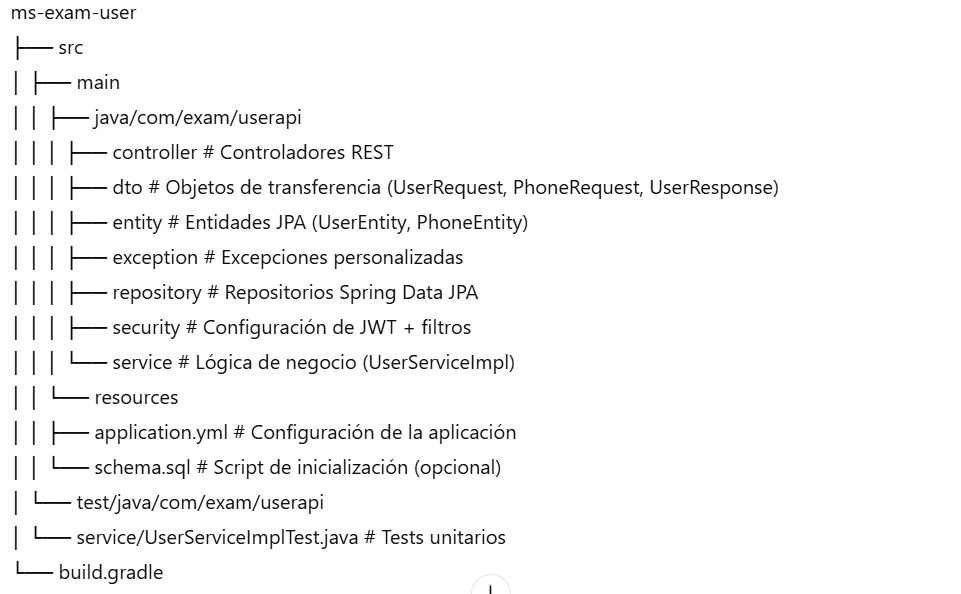
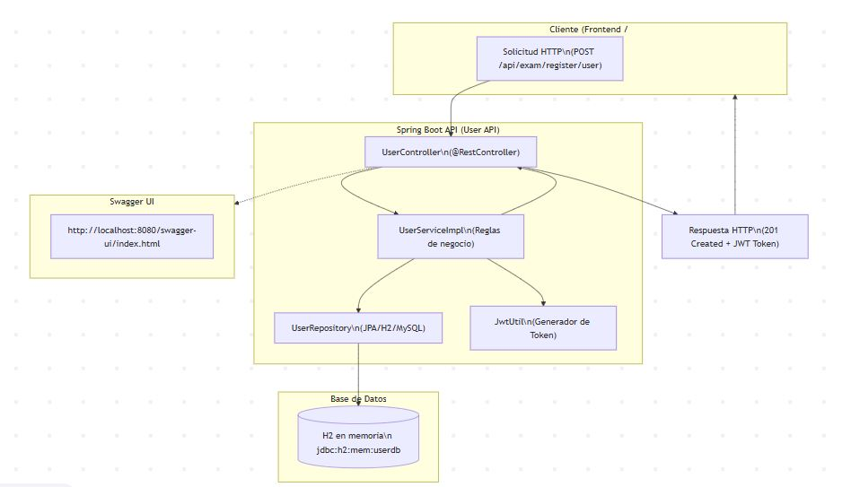

# User API (Registro)

# 📌 ms-exam-user

Microservicio desarrollado en **Java 17 + Spring Boot 3** que expone un API REST para la **gestión de usuarios** con autenticación mediante **JWT**.  
Incluye registro de usuarios, validación de correo único, manejo de teléfonos y seguridad con **Spring Security**.  

---

## 🚀 Tecnologías utilizadas

- **Java 17**
- **Spring Boot 3**
  - Spring Web
  - Spring Security + JWT
  - Spring Data JPA
- **Base de datos:** MySQL
- **Build Tool:** Gradle 8
- **Swagger / OpenAPI 3** para documentación
- **Lombok** para reducción de boilerplate
- **JUnit 5 + Mockito** para pruebas unitarias

---

## 📂 Estructura del proyecto




# 1. Compilar el proyecto
./gradlew clean build

# 2. Ejecutar el microservicio
./gradlew bootRun


## 3. Registrar un usuario (ejemplo usando curl)
```bash
curl --location --request POST 'http://localhost:8080/api/exam/register/user' \
--header 'Content-Type: application/json' \
--header 'Cookie: JSESSIONID=1757CEEF06C4FAC911EBE88FEDEEA227' \
--data-raw '{
    "name": "Elvis Ayay Davila",
    "email": "elvisad30@gmail.com",
    "password": "Password1",
    "phones": [
        {
            "number": "1234567",
            "citycode": "1",
            "contrycode": "57"
        }
    ]
}'
```

## 4. Documentación Swagger
[http://localhost:8080/swagger-ui/index.html](http://localhost:8080/swagger-ui/index.html)

## 5. H2 Console
[http://localhost:8080/h2-console](http://localhost:8080/h2-console)  
**JDBC URL:** `jdbc:h2:mem:userdb`

## 6. Diagrama de Solucion




---
⚠️ **OBS:** Cambie `app.jwt.secret` en `application.properties` antes de producción.
